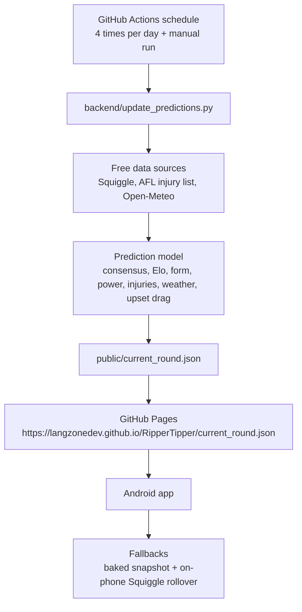

# Ripper Tipper architecture

Ripper Tipper keeps the phone app simple and moves the heavier prediction work
into a scheduled GitHub Actions backend.



## Runtime behaviour

1. GitHub Actions runs the backend on a schedule.
2. The backend generates `backend/output/current_round.json`.
3. The workflow publishes that JSON to GitHub Pages as `current_round.json`.
4. The Android app checks the hosted JSON whenever it refreshes.
5. If the hosted JSON is unavailable, the app falls back to its baked snapshot
   and on-device Squiggle round rollover.

The app should remain a presentation layer: it shows the current round, one pick
per match, confidence, and a short explanation. The hosted backend can evolve
without forcing a new APK for every model tweak.

## Hosted endpoint

Expected production URL:

```text
https://langzonedev.github.io/RipperTipper/current_round.json
```

If GitHub Pages has not been enabled yet, open the repository settings and set
Pages to deploy from GitHub Actions. The workflow is already configured for
Actions-based Pages deployment.
