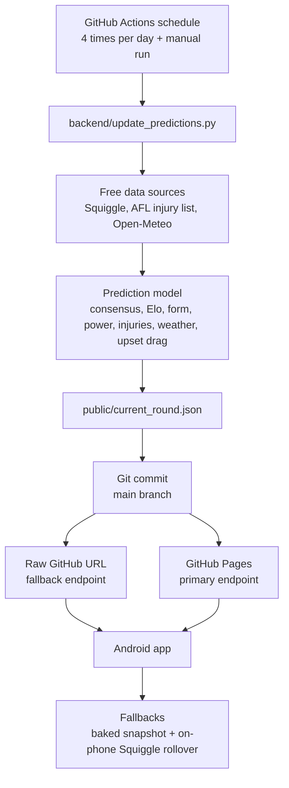

# Ripper Tipper architecture

Ripper Tipper keeps the phone app simple and moves the heavier prediction work
into a scheduled GitHub Actions backend.



## Runtime behaviour

1. GitHub Actions runs the backend on a schedule.
2. The backend generates `backend/output/current_round.json`.
3. The workflow copies that JSON to `public/current_round.json`.
4. The workflow commits refreshed prediction data back to the repository.
5. The Android app checks hosted JSON whenever it refreshes.
6. If the hosted JSON is unavailable, the app falls back to its baked snapshot
   and on-device Squiggle round rollover.

The app should remain a presentation layer: it shows the current round, one pick
per match, confidence, and a short explanation. The hosted backend can evolve
without forcing a new APK for every model tweak.

## Hosted endpoint

Potential production URLs:

```text
https://langzonedev.github.io/RipperTipper/current_round.json
https://raw.githubusercontent.com/langzonedev/RipperTipper/main/public/current_round.json
```

GitHub Pages is enabled for this public repository. The Android app tries Pages
first, then raw GitHub, then its local/on-device fallbacks.
